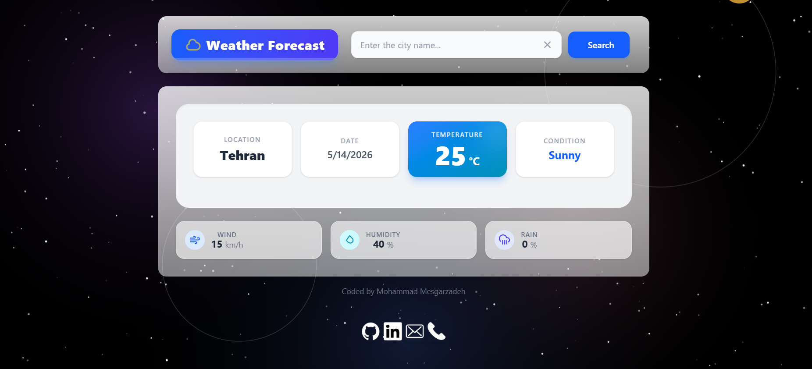

# Weather
A modern and practical Weather App for displaying real-time weather information. Built with HTML, Tailwind CSS, and JavaScript, this project shows details such as temperature, weather conditions, humidity, and wind speed.

[Demo Project](https://mohammad-mesgarzadeh.github.io/Weather/)

- get in touch with me via *mohammadmesgarzadeh8@gmail.com*

<h3 align="left">Connect with me:</h3>

	

